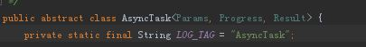

AsyncTask 代码分析
====================

在Android实际开发过程设计到网络图片下载等耗时操作，需要使用线程进行处理。子线程和UI主线程的交互处理主要通过Thread + Handler方式进行处理。google为了方便开发人员开发，在SDK中引入AsyncTask，使用它可以
简单灵活地从子线程切换UI主线程。本文主要从AsyncTask源码角度分析该类。


AsyncTask使用
---------------

首先AsyncTask是一个抽象类，因此如果我们需要使用它，我们必须创建一个继承它的子类.

其次我们现实该子类的时候需要指定3个泛型参数，这个参数的用途如下:

1.Parmas：在执行AsyncTask时需要传入的参数，可用于在后台任务中使用。

2.Progress:后台执行任务时，如果需要在UI线程中显示进度，使用该泛型作为进度单位

3.Result:当任务执行完毕后，如果需要返回结果，使用该泛型作为返回值类型

源码描述如下图:


AsyncTask简单使用方式如下：
```java
    class SampleTask extends AsyncTask<Void, Integer, Boolean> {  
         .....  
         @Override  
         protected Boolean doInBackground(Void... params) { 
            .....
         }
         @Override  
         protected void onProgressUpdate(Integer... values) {  
            ......
         }
         @Override  
         protected void onPostExecute(Boolean result) {  
            .......    
         }
         ......
    }  
```
>如上述代码,定义第一个泛型为Void，表示在执行后台任务时不需要传入参数；定义第二个泛型是Integer，表示使用整数类型作为进度显示类型；定义第三个
泛型为Boolean，表示使用Boolean类型作为后台任务完成返回类型。

如上述代码所示，我们定义的AsyncTask重写了3个办法，这3个方法和之前定义的三个泛型有直接联系。如了这3个,还有常用的方法为onPreExecute。现在我们介绍一下这个4个方法。

1.onPreExecute:该方法会在后台任务执行之前调用，其运行在UI线程中。主要作用是在界面上有一些初始化操作，比如显示一个进度条。

2.doInBackground:该方法是使用AsyncTask必须重写的方法，其运行在子线程中。主要作用是执行一些耗时操作。

3.onProgressUpdate:该方法是在后台任务中调用punlishProgress方法之后执行，它传入的参数泛型是Progress，上述代码就指代Integer。主要作用是在后台任务执行过程中和UI线程实现通信。

4.onPostExecute:该方法是后台任务执行完毕并通过return返回时，调用该方法。该方法主要作用是在UI线程中获知任务执行完毕或得到返回结果。

上述代码完整实现可以如下：

```java
    class SampleTask extends AsyncTask<Void, Integer, Boolean> {  
         @Override  
             protected void onPreExecute() {  
                 progressDialog.show();  
             }  
           
             @Override  
             protected Boolean doInBackground(Void... params) {  
                 try {  
                     while (true) {  
                         int downloadPercent = doDownload();  
                         publishProgress(downloadPercent);  
                         if (downloadPercent >= 100) {  
                             break;  
                         }  
                     }  
                 } catch (Exception e) {  
                     return false;  
                 }  
                 return true;  
             }  
           
             @Override  
             protected void onProgressUpdate(Integer... values) {  
                 progressDialog.setMessage("当前下载进度：" + values[0] + "%");  
             }  
           
             @Override  
             protected void onPostExecute(Boolean result) {  
                 progressDialog.dismiss();  
                 if (result) {  
                     Toast.makeText(context, "下载成功", Toast.LENGTH_SHORT).show();  
                 } else {  
                     Toast.makeText(context, "下载失败", Toast.LENGTH_SHORT).show();  
                 }  
             }  
    }  
```
启动该AsyncTask如下述代码
```java
    new SampleTask().execute();
```

AsyncTask源码分析
===================

如上述代码，我们发现该AsyncTask执行之前需要先new出一个对象，那我们先看AsyncTask的构建函数是怎么样？

```java
    public AsyncTask() {
        mWorker = new WorkerRunnable<Params, Result>() {
            public Result call() throws Exception {
                mTaskInvoked.set(true);
                Result result = null;
                try {
                    //定义线程优先级
                    Process.setThreadPriority(Process.THREAD_PRIORITY_BACKGROUND);
                    //noinspection unchecked
                    result = doInBackground(mParams);
                    Binder.flushPendingCommands();
                } catch (Throwable tr) {
                    mCancelled.set(true);
                    throw tr;
                } finally {
                    postResult(result);
                }
                return result;
            }
        };

        mFuture = new FutureTask<Result>(mWorker) {
            @Override
            protected void done() {
                try {
                    postResultIfNotInvoked(get());
                } catch (InterruptedException e) {
                    android.util.Log.w(LOG_TAG, e);
                } catch (ExecutionException e) {
                    throw new RuntimeException("An error occurred while executing doInBackground()",
                            e.getCause());
                } catch (CancellationException e) {
                    postResultIfNotInvoked(null);
                }
            }
        };
    }
    private static abstract class WorkerRunnable<Params, Result> implements Callable<Result> {
          Params[] mParams;
    }
```
>由AsyncTask的构造函数我们可以看到，在构造函数主要定义2个变量mWorker，mFuture。其中mWorker是Callable对象，mFuture是FutureTask对象，mWorker会作为参数传入到mFuture中。


构建完成之后将会执行execute方法

```java
    @MainThread
        public final AsyncTask<Params, Progress, Result> execute(Params... params) {
            return executeOnExecutor(sDefaultExecutor, params);
        }
```
execute方法将调用executeOnExecutor方法，并传入sDefaultExecutor以及之前定义泛型Params参数。sDefaultExecutor的定义如下
```java
    private static volatile Executor sDefaultExecutor = SERIAL_EXECUTOR;
    public static final Executor SERIAL_EXECUTOR = new SerialExecutor();
    private static class SerialExecutor implements Executor {
        final ArrayDeque<Runnable> mTasks = new ArrayDeque<Runnable>();
        Runnable mActive;
    
        public synchronized void execute(final Runnable r) {
            mTasks.offer(new Runnable() {
                public void run() {
                    try {
                        r.run();
                    } finally {
                        scheduleNext();
                    }
                }
            });
            if (mActive == null) {
                scheduleNext();
            }
        }
    
        protected synchronized void scheduleNext() {
            if ((mActive = mTasks.poll()) != null) {
                THREAD_POOL_EXECUTOR.execute(mActive);
            }
        }
    }
```
如代码所示sDefaultExecutor其实就是SerialExecutor.
>SerialExecutor以static修饰，那么无论new 多少个AsyncTask都只有一个SerialExecutor对象。SerialExecutor是使用ArrayDeque这个队列来管理Runnable。如果我们一次性启动了很多个任务，首先在第一次运行execute方法时，会调用ArratDeque的offer方法将
传入Runnable对象添加到Deque的队列的尾部，然后判断mActive对象是不是等于null。如果是第一次运行当然是null，那么他们会调用scheduleNext方法。在这个队列中头部取值，并赋值给mActive，然后调用THREAD_POOL_EXECUTOR去执行取出来的Runnable.如果后续
还有线程加入在执行offer添加到队列中。
那之后添加到ArrayDeque是怎么执行？我们可以看到offer方法传入的Runnable匿名类，该类中使用try finally方法。当之前的线程执行完成之后，在finally中调用了scheduleNext，执行后续的进程。该方法也就是说AsyncTask在同一个时刻只能执行一个线程，其他线程
是出于等待状态。
也就是表示：原生的AsyncTask是串行执行线程的。

```java
        @MainThread
        public final AsyncTask<Params, Progress, Result> executeOnExecutor(Executor exec,
                Params... params) {
            if (mStatus != Status.PENDING) {
                switch (mStatus) {
                    case RUNNING:
                        throw new IllegalStateException("Cannot execute task:"
                                + " the task is already running.");
                    case FINISHED:
                        throw new IllegalStateException("Cannot execute task:"
                                + " the task has already been executed "
                                + "(a task can be executed only once)");
                }
            }
            mStatus = Status.RUNNING;
            onPreExecute();
            mWorker.mParams = params;
            exec.execute(mFuture);
            return this;
        }
```

>在executeOnExecutor我们看到了onPreExecute方法，它在执行后台任务之前调用，证明了上文的说法。同时我们也看到一点：AsyncTask的方法在执行之后不能重复执行

在executeOnExecutor中执行execute方法实际调用到SerialExecutor中execute方法，我们看到这个方法传入的是Runnable，那这个Runnable是哪个呢？不错是mFuture这个参数，实际上调用的是FutureTask中的run方法
```java
        public void run() {
            if (state != NEW ||
                !UNSAFE.compareAndSwapObject(this, runnerOffset,
                                             null, Thread.currentThread()))
                return;
            try {
                Callable<V> c = callable;
                if (c != null && state == NEW) {
                    V result;
                    boolean ran;
                    try {
                        result = c.call();
                        ran = true;
                    } catch (Throwable ex) {
                        result = null;
                        ran = false;
                        setException(ex);
                    }
                    if (ran)
                        set(result);
                }
            } finally {
                // runner must be non-null until state is settled to
                // prevent concurrent calls to run()
                runner = null;
                // state must be re-read after nulling runner to prevent
                // leaked interrupts
                int s = state;
                if (s >= INTERRUPTING)
                    handlePossibleCancellationInterrupt(s);
            }
        }
```
我们看到run方法调用了callable的call()方法，callable对象事实上是之前传入的mWorker。也就是调用mWorker中的call中方法，该方法中会执行doInBackground这个方法，也就是我们必须重写后台任务方法。在call方法中最后会调用postResult方法

```java
    private Result postResult(Result result) {
            @SuppressWarnings("unchecked")
            Message message = getHandler().obtainMessage(MESSAGE_POST_RESULT,
                    new AsyncTaskResult<Result>(this, result));
            message.sendToTarget();
            return result;
    }
```

postResult采用handler机制将result发到UI线程中,
```java
  
    private static class InternalHandler extends Handler {
           public InternalHandler() {
               super(Looper.getMainLooper());
           }
   
           @SuppressWarnings({"unchecked", "RawUseOfParameterizedType"})
           @Override
           public void handleMessage(Message msg) {
               AsyncTaskResult<?> result = (AsyncTaskResult<?>) msg.obj;
               switch (msg.what) {
                   case MESSAGE_POST_PROGRESS:
                       result.mTask.onProgressUpdate(result.mData);
                       break;
                   case MESSAGE_POST_RESULT:
                       // There is only one result
                       result.mTask.finish(result.mData[0]);
                       break;
               }
           }
       }
```
之后执行finish方法

```java
        private void finish(Result result) {
            if (isCancelled()) {
                onCancelled(result);
            } else {
                onPostExecute(result);
            }
            mStatus = Status.FINISHED;
        }
```

在finish我们看到了onPostExecute方法。

那onProgressUpdate是怎么调用的呢？在InternalHandler方法中我们其实看到接收到的Message也有MESSAGE_POST_PROGRESS。而这个消息的发送时在这个方法中实现的

```java
        protected final void publishProgress(Progress... values) {
            if (!isCancelled()) {
                getHandler().obtainMessage(MESSAGE_POST_PROGRESS,
                        new AsyncTaskResult<Progress>(this, values)).sendToTarget();
            }
        }
```
没错。就是publishProgress这个方法实现的。这个说明了上文所说的通过调用punlishProgress方法和UI线程中onProgressUpdate实时通信。

拓展：如何将AsyncTask的任务执行修改为并行执行？
-----------------------------------------------
1.如上文所说AsyncTask默认的执行状态是串行，那我们希望改成并行应该如何处理的呢？

我们知道AsyncTask之所以是串行执行的是因为SerialExecutor导致，那我们如果希望是并行执行，我们只需要将Executor修改成可以并行执行就可以了。
```java
    Executor exec = new ThreadPoolExecutor(15, 200, 10,  
            TimeUnit.SECONDS, new LinkedBlockingQueue<Runnable>());  
    new SampleTask().executeOnExecutor(exec);  
```

2.AsyncTask的初始化是否可以在子线程中执行？

可以的，但是android5.1之前版本不可以。原因是：我们知道AsyncTask和主线程交互式通过handler方式实现的。但是5.1之前和 5.1之后的版本的handler定义如下，我们5.1之前的版本的使用的默认线程的Looper，
5.1之后获取的是UI线程的Looper。在5.1之前的版本如果你的AsyncTask是在子线程创建的，那么很不幸，你的onPreExecute和onPostExecute并非在UI线程执行，而是被Handler post到创建它的那个线程执行；
如果你在这两个线程更新了UI，那么直接导致崩溃。

```java
    //android 5.0
   private static class InternalHandler extends Handler {
     @SuppressWarnings({"unchecked", "RawUseOfParameterizedType"})
     @Override
     public void handleMessage(Message msg) {
         AsyncTaskResult result = (AsyncTaskResult) msg.obj;
         switch (msg.what) {
             case MESSAGE_POST_RESULT:
                 // There is only one result
                 result.mTask.finish(result.mData[0]);
                 break;
             case MESSAGE_POST_PROGRESS:
                 result.mTask.onProgressUpdate(result.mData);
                 break;
         }
     }
     
     //android 5.1
     private static class InternalHandler extends Handler {
                public InternalHandler() {
                    super(Looper.getMainLooper());
                }
        
                @SuppressWarnings({"unchecked", "RawUseOfParameterizedType"})
                @Override
                public void handleMessage(Message msg) {
                    AsyncTaskResult<?> result = (AsyncTaskResult<?>) msg.obj;
                    switch (msg.what) {
                        case MESSAGE_POST_PROGRESS:
                            result.mTask.onProgressUpdate(result.mData);
                            break;
                        case MESSAGE_POST_RESULT:
                            // There is only one result
                            result.mTask.finish(result.mData[0]);
                            break;
                    }
                }
            }
```


   


