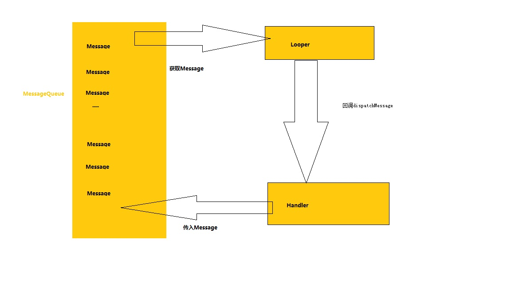

Handler 机制分析
==================
android 子线程和UI线程的交互主要使用Handler的方法进行通信。本文分析Handler机制

Handler 如何使用？
------------------------
Handler的使用比较简单
```java
    public class MainActivity extends Activity{
        private Handler handler = new Handler() {  
             public void handleMessage(Message msg) {   
                  switch (msg.what) {   
                    case 0x01:
                        //do somethings
                  }
             }
          };
         
        @Override  
         protected void onCreate(Bundle savedInstanceState) {  
             super.onCreate(savedInstanceState);  
             setContentView(R.layout.activity_main);  
             handler = new Handler();
             new Thread(new Runnable(){
                 @Override
                 public void run(){
                      Message message = new Message();   
                      message.what = 0x01;   
                      handler.sendMessage(message);
                 }
             }).start();
         }
    }
```
如果代码就是一个简单的Handler的使用Demo,有如下几个问题
1.Handler 是否可以在子线程中初始化。可以，但是如下代码执行的话会抛出该错误"Can't create handler inside thread that has not called Looper.prepare() ".说
是不能再没有调用Looper.prepare()的线程中创建Handler。因此如果需要在线程中创建Handler首先调用一下Looper.prepare
```java
    new Thread(new Runnable() {  
        @Override  
        public void run() {  
            Handler handler = new Handler();  
        }  
    }).start();  
```
这样调用将不会抛出异常。
```java
    new Thread(new Runnable() {  
        @Override  
        public void run() {
            Looper.prepare();
            Handler handler = new Handler();  
            Looper.loop();
        }  
    }).start();  
```

Looper和Handler的联系是什么样的呢？
--------------------------------
我们看一下Handler初始化的代码
```java
    public Handler(Callback callback, boolean async) {
        if (FIND_POTENTIAL_LEAKS) {
            final Class<? extends Handler> klass = getClass();
            if ((klass.isAnonymousClass() || klass.isMemberClass() || klass.isLocalClass()) &&
                    (klass.getModifiers() & Modifier.STATIC) == 0) {
                Log.w(TAG, "The following Handler class should be static or leaks might occur: " +
                    klass.getCanonicalName());
            }
        }

        mLooper = Looper.myLooper();
        if (mLooper == null) {
            throw new RuntimeException(
                "Can't create handler inside thread that has not called Looper.prepare()");
        }
        mQueue = mLooper.mQueue;
        mCallback = callback;
        mAsynchronous = async;
    }
```
可以看到如果mLooper是通过Looper.myLooper获得一个Looper对象，如果Looper对象为空，则抛出上述异常。那Looper.myLooper是如何定义的呢？
```java
     public static @Nullable Looper myLooper() {
            return sThreadLocal.get();
    }
```
该方法很简单就是从sThreadLocal对象中去除Looper对象。如果sThreadLocal中存在就返回Looper，如果没有就返回null。那Looper是如何存放在sThreadLocal中，
不错就是Looper.prepare。
```java
      private static void prepare(boolean quitAllowed) {
          if (sThreadLocal.get() != null) {
              throw new RuntimeException("Only one Looper may be created per thread");
          }
          sThreadLocal.set(new Looper(quitAllowed));
      }
```
可以看到，首先判断sThreadLocal中是否存在Looper对象，如果已经存在，那么如果还有prepare Looper则抛出异常；否则就新建一个Looper存放到sThreadLocal中。
该代码同时说明每个线程最多一个Looper对象。
>Looper采用ThreadLocal来维护各个线程的Looper对象。ThreadLocal是什么呢？官方定义是：ThreadLocal实现了线程本地存储。所有线程共享同一个ThreadLocal对象，但不同线程仅能访问与其线程相关联的值，一个线程修改ThreadLocal对象对其他线程没有影响。
我们可以将ThreadLocal理解为一块存储区，将这一大块存储区分割为多块小的存储区，每一个线程拥有一块属于自己的存储区，那么对自己的存储区操作就不会影响其他线程。对于ThreadLocal<Looper>，则每一小块存储区中就保存了与特定线程关联的Looper。 

主线程中使用Handler时为什么没有执行Looper.prepare()也可以使用Handler呢？其实在进程启动的时候我们已经创建了主线程也依赖的Looper，代码在ActivityThread中main方法中。
```java
     public static void main(String[] args) {
        ....
        Looper.prepareMainLooper();
        ActivityThread thread = new ActivityThread();
        thread.attach(false);
    
        if (sMainThreadHandler == null) {
            sMainThreadHandler = thread.getHandler();
        }
    
        if (false) {
            Looper.myLooper().setMessageLogging(new
                    LogPrinter(Log.DEBUG, "ActivityThread"));
        }
    
        // End of event ActivityThreadMain.
        Trace.traceEnd(Trace.TRACE_TAG_ACTIVITY_MANAGER);
        Looper.loop();
    
        throw new RuntimeException("Main thread loop unexpectedly exited");
     }
```
可以看到该方法执行的是Looper.prepareMainLooper方法,可看到归根到底还是执行prepare方法
```java
    public static void prepareMainLooper() {
        prepare(false);
        synchronized (Looper.class) {
            if (sMainLooper != null) {
                throw new IllegalStateException("The main Looper has already been prepared.");
            }
            sMainLooper = myLooper();
        }
    }
```

Message又是如何引入到Handler机制的？
---------------------------------------
众所周知，我们都知道Handler，Message，Looper是Handler机制不可或缺的要素。那么Message都是如何引入到Handler.我们看一下上述例子Message是通过handler.sendMessage(message)引入到Handler中。
```java
      public final boolean sendMessage(Message msg)
      {
          return sendMessageDelayed(msg, 0);
      }
      
      public final boolean sendMessageDelayed(Message msg, long delayMillis)
      {
          if (delayMillis < 0) {
              delayMillis = 0;
          }
          return sendMessageAtTime(msg, SystemClock.uptimeMillis() + delayMillis);
      }
     public boolean sendMessageAtTime(Message msg, long uptimeMillis) {
         MessageQueue queue = mQueue;
         if (queue == null) {
             RuntimeException e = new RuntimeException(
                     this + " sendMessageAtTime() called with no mQueue");
             Log.w("Looper", e.getMessage(), e);
             return false;
         }
         return enqueueMessage(queue, msg, uptimeMillis);
      }
      private boolean enqueueMessage(MessageQueue queue, Message msg, long uptimeMillis) {
             msg.target = this;
             if (mAsynchronous) {
                 msg.setAsynchronous(true);
             }
             return queue.enqueueMessage(msg, uptimeMillis);
      }
```
可以看到sendMessage最终调用MessageQueue中enqueueMessage
```java
    boolean enqueueMessage(Message msg, long when) {
             ....
            msg.markInUse();
            msg.when = when;
            Message p = mMessages;
            boolean needWake;
            if (p == null || when == 0 || when < p.when) {
                // New head, wake up the event queue if blocked.
                msg.next = p;
                mMessages = msg;
                needWake = mBlocked;
            } else {
                // Inserted within the middle of the queue.  Usually we don't have to wake
                // up the event queue unless there is a barrier at the head of the queue
                // and the message is the earliest asynchronous message in the queue.
                needWake = mBlocked && p.target == null && msg.isAsynchronous();
                Message prev;
                for (;;) {
                    prev = p;
                    p = p.next;
                    if (p == null || when < p.when) {
                        break;
                    }
                    if (needWake && p.isAsynchronous()) {
                        needWake = false;
                    }
                }
                msg.next = p; // invariant: p == prev.next
                prev.next = msg;
            }

            // We can assume mPtr != 0 because mQuitting is false.
            if (needWake) {
                nativeWake(mPtr);
            }
        }
        return true;
    }
```
MessageQueue并没有使用一个集合把信息保存，它只是通过使用mMessage对象表示当前需要处理消息，然后根据时间把msg进行排序。具体方法是根据时间顺序调用msg.next。从而为每一个消息指定它
的下一个消息是什么。如果需要将msg作为队头插入到MessageQueue中可以调用sendMessageAtFrontOfQueue实现。

这样消息就进入到MessageQueue中，那如何从MessageQueue中将消息取出来呢？
大家有没有注意到Loop.prepare一般和Looper.loop对应使用。其实Looper.loop就是用来从MessageQueue中取出message。
``java
    public static void loop() {
        final Looper me = myLooper();
        if (me == null) {
            throw new RuntimeException("No Looper; Looper.prepare() wasn't called on this thread.");
        }
        final MessageQueue queue = me.mQueue;

        // Make sure the identity of this thread is that of the local process,
        // and keep track of what that identity token actually is.
        Binder.clearCallingIdentity();
        final long ident = Binder.clearCallingIdentity();

        for (;;) {
            Message msg = queue.next(); // might block
            if (msg == null) {
                // No message indicates that the message queue is quitting.
                return;
            }

            // This must be in a local variable, in case a UI event sets the logger
            final Printer logging = me.mLogging;
            if (logging != null) {
                logging.println(">>>>> Dispatching to " + msg.target + " " +
                        msg.callback + ": " + msg.what);
            }

            final long traceTag = me.mTraceTag;
            if (traceTag != 0 && Trace.isTagEnabled(traceTag)) {
                Trace.traceBegin(traceTag, msg.target.getTraceName(msg));
            }
            try {
                msg.target.dispatchMessage(msg);
            } finally {
                if (traceTag != 0) {
                    Trace.traceEnd(traceTag);
                }
            }
            ....
        }
    }
    
上文我们知道每个Thread都有一个Looper，其实每个Looper都对应一个MessageQueue。loop方法我们获得对应looper中的MessageQueue不断取出msg，并传入到dispatchMessage.
dispatchMessage方法将取出的msg传递到定义Handler时重写的handleMessage方法。
```java
    public void dispatchMessage(Message msg) {
            if (msg.callback != null) {
                handleCallback(msg);
            } else {
                if (mCallback != null) {
                    if (mCallback.handleMessage(msg)) {
                        return;
                    }
                }
                handleMessage(msg);
            }
        }
```

Handler,Message,MessageQueue,Looper流程示意图如下：

        
  