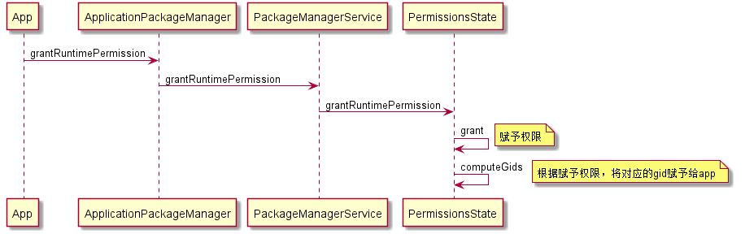

android 权限机制与Linux Gid的关联
=============
问题：

1.Linux系统是支持多用户的系统。那为什么不同用户对于同一个文件或文件夹的操作权限是不一样的？

Linux系统的文件权限机制：每个文件都是属于某个用户，该用户就是该文件的所有者。文件对不同用户具有不同的读写不同的操作权限。但是如果不同用户隶属于同一个用户组中，那么在同一个用户组的权限。那么指定该用户组具有什么权限，那边该用户组中的用户都具有该用户组所有用户的权限。

2.Android 系统是基于Linux内核开发，因此Android也继承Linux的用户和文件权限的管理机制。那这种机制是如何体现的呢?

1)Android 权限的赋予可分为两类，一类是上层的权限，例如应用和系统服务部分的权限(如读写联系人的权限)，这部分的权限主要采用包管理器依赖就行管理。第二类的底层的权限，这部分则利用了Linux DAC机制进行管理(如访问网络权限)。

2)Linux DAC机制主要就是采用用户组的方式实现权限控制。
在platform.xml中定义权限和groupName是关联
```xml
     <!-- The following tags are associating low-level group IDs with
             permission names.  By specifying such a mapping, you are saying
             that any application process granted the given permission will
             also be running with the given group ID attached to its process,
             so it can perform any filesystem (read, write, execute) operations
             allowed for that group. -->
    
        <permission name="android.permission.BLUETOOTH_ADMIN" >
            <group gid="net_bt_admin" />
        </permission>
    
        <permission name="android.permission.BLUETOOTH" >
            <group gid="net_bt" />
        </permission>
    
        <permission name="android.permission.BLUETOOTH_STACK" >
            <group gid="net_bt_stack" />
            <group gid="wakelock" />
        </permission>
       .....
```
在android_filesystem_config.h定义了group name与gid的关联。
```c++
    ....
    { "net_bt_admin",  AID_NET_BT_ADMIN, },
    { "net_bt",        AID_NET_BT, },
    { "inet",          AID_INET, },
    { "net_raw",       AID_NET_RAW, },
    { "net_admin",     AID_NET_ADMIN, },
    { "net_bw_stats",  AID_NET_BW_STATS, },
    { "net_bw_acct",   AID_NET_BW_ACCT, },
    { "net_bt_stack",  AID_NET_BT_STACK, },
    { "readproc",      AID_READPROC, },
    { "wakelock",      AID_WAKELOCK, },
    { "sensors",       AID_SENSORS, },
    ....
```
3)该种权限的赋予流程



```java
 /**
     * Compute the Linux gids for a given device user from the permissions
     * granted to this user. Note that these are computed to avoid additional
     * state as they are rarely accessed.
     *
     * @param userId The device user id.
     * @return The gids for the device user.
     */
    public int[] computeGids(int userId) {
        enforceValidUserId(userId);

        int[] gids = mGlobalGids;

        if (mPermissions != null) {
            final int permissionCount = mPermissions.size();
            for (int i = 0; i < permissionCount; i++) {
                String permission = mPermissions.keyAt(i);
                if (!hasPermission(permission, userId)) {
                    continue;
                }
                PermissionData permissionData = mPermissions.valueAt(i);
                final int[] permGids = permissionData.computeGids(userId);
                if (permGids != NO_GIDS) {
                    gids = appendInts(gids, permGids);
                }
            }
        }

        return gids;
    }

```

参考资料
--------
[1]http://www.educity.cn/wenda/174474.html


