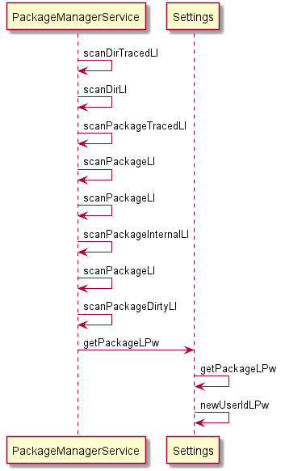

android uid分析
=====================
我们都是知道没有一个apk都有一个唯一的uid，那这个uid是怎么来的呢?本文分析一下uid是怎么来的。

首先先明确一下uid其实是每次开机PMS在扫描apk时，分配uid给apk。



```java
 private int newUserIdLPw(Object obj) {
        // Let's be stupidly inefficient for now...
        final int N = mUserIds.size();
        for (int i = mFirstAvailableUid; i < N; i++) {
            if (mUserIds.get(i) == null) {
                mUserIds.set(i, obj);
                return Process.FIRST_APPLICATION_UID + i;
            }
        }

        // None left?
        if (N > (Process.LAST_APPLICATION_UID-Process.FIRST_APPLICATION_UID)) {
            return -1;
        }

        mUserIds.add(obj);
        return Process.FIRST_APPLICATION_UID + N;
    }
```