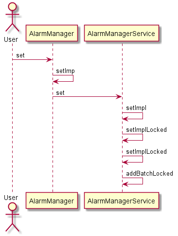
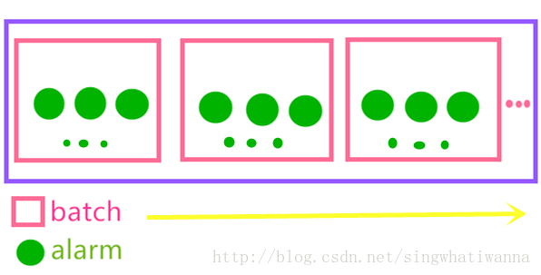
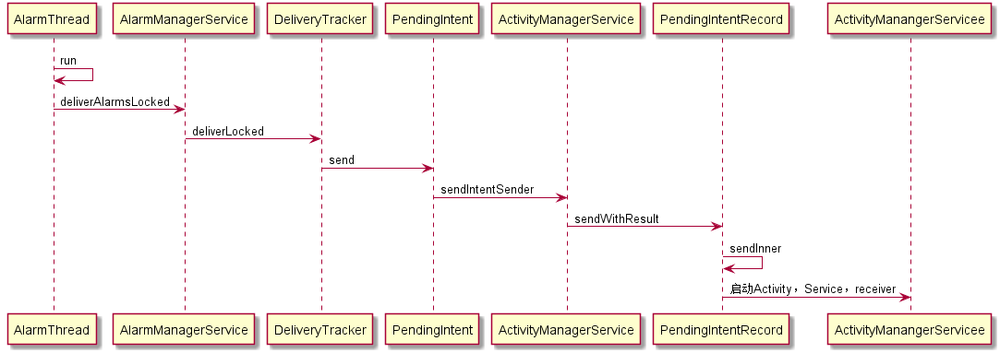

Android Framework : Alarm 机制
============================

Alarm是什么？
-------------
Alarm可以理解为系统闹钟。系统通过采用该种机制来实现系统在未来某个时间点执行某种功能。系统中Alarm通过AlarmManagerService管理系统中的Alarm。
```java
        Intent intent = new Intent();
        intent.setAction(Constatnt.AUTO_CLEAN_BROADCAST);
        AlarmManager alarmManager = (AlarmManager) mContext.getSystemService(Context.ALARM_SERVICE);
        PendingIntent pendingIntent = PendingIntent.getBroadcast(mContext, 0, intent, 0);
        //5分钟之后执行该Alarm
        alarmManager.setExactAndAllowWhileIdle(AlarmManager.RTC_WAKEUP, System.currentTimeMillis()+5*Constatnt.ONE_MINUTE, pendingIntent);
```
Alarm 设置流程
----------------
如下流程图，描述了Alarm简单的设置流程



AlarmManagerService是如何管理Alarm的呢？
----------------------------------------

Android官方文档指出：从Android4.4开始，Alarm默认采用的是非准确模式(该种该模式的目的是减少wakeup以及降低电量使用).在AlarmManagerService中，每一个Alarm根据其
触发时间和最大触发时间存放在不同的batch。在典型的情况下：最大触发时间 = 触发时间 + 时间窗口。在Batch内部所有的batch是按开始
时间升序排列，所有的Alarm唤醒顺序按照batch的排列顺序触发，同一个batch的不同alarm是同时发生的。示意图如下


代码描述入下：
```java
        private void setImplLocked(int type, long when, long whenElapsed, long windowLength,
            long maxWhen, long interval, PendingIntent operation, IAlarmListener directReceiver,
            String listenerTag, int flags, boolean doValidate, WorkSource workSource,
            AlarmManager.AlarmClockInfo alarmClock, int callingUid, String callingPackage) {
        //根据Alarm传入的值构建一个Alarm
        Alarm a = new Alarm(type, when, whenElapsed, windowLength, maxWhen, interval,
                operation, directReceiver, listenerTag, workSource, flags, alarmClock,
                callingUid, callingPackage);
        try {
            if (ActivityManagerNative.getDefault().getAppStartMode(callingUid, callingPackage)
                    == ActivityManager.APP_START_MODE_DISABLED) {
                Slog.w(TAG, "Not setting alarm from " + callingUid + ":" + a
                        + " -- package not allowed to start");
                return;
            }
        } catch (RemoteException e) {
        }
        removeLocked(operation, directReceiver);
        setImplLocked(a, false, doValidate);
    }
    
    
    private void setImplLocked(Alarm a, boolean rebatching, boolean doValidate) {
        ..........
            //根据Alarm属性获取对应的Batch，如果没有返回-1；否则获得对应的位置
            int whichBatch = ((a.flags&AlarmManager.FLAG_STANDALONE) != 0)
                    ? -1 : attemptCoalesceLocked(a.whenElapsed, a.maxWhenElapsed);
            if (whichBatch < 0) {
                //如果没有对应batch，构建一个新的batch.
                Batch batch = new Batch(a);
                //将这个Batch加入到Batch List
                addBatchLocked(mAlarmBatches, batch);
            } else {
                //获得对应的Batch
                Batch batch = mAlarmBatches.get(whichBatch);
                //将Alarm添加到Batch中
                if (batch.add(a)) {
                    // The start time of this batch advanced, so batch ordering may
                    // have just been broken.  Move it to where it now belongs.
                    mAlarmBatches.remove(whichBatch);
                    addBatchLocked(mAlarmBatches, batch);
                }
            }
        ........
        }
```

Alarm如果被唤醒，如何执行相关的操作呢？
-------------------------------------------
AlarmManagerService中有一个AlarmThread，该线程在该Service启动后就一直执行。该线程不停的遍历Batch列表，查看是否有Alarm需要执行(该流程类似于Loop与MessageQueue)。
流程图如下



参考资料
--------
[1]http://blog.csdn.net/wh_19910525/article/details/44303039