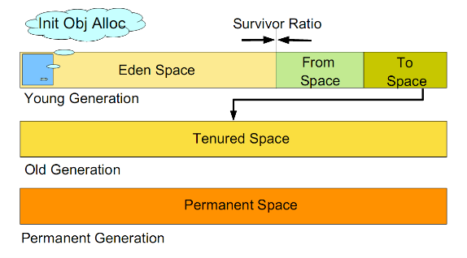

1.java中的引用有几种?

java的引用有四种:强引用，弱引用，软引用，虚引用

**强引用**是最普遍的引用。如果一个对象具有强引用，即使出现OOM不也会回收强引用对象。如果不使用该对象可以将其设置为null。

**软引用**:如果一个对象只具有软引用，则内存空间足够，垃圾回收器就不会回收它；如果内存空间不足了，就会回收这些对象的内存。定义方式为
```java
    String str=new String("强应用");                                     // 强引用  
    SoftReference<String> softRef=new SoftReference<String>(str);     // 软引用    
```
**弱应用**:弱引用与软引用的区别在于：只具有弱引用的对象拥有更短暂的生命周期。在垃圾回收器线程扫描它所管辖的内存区域的过程中，一旦发现了只具有弱引用的对象，不管当前内存空间足够与否，都会回收它的内存。
```java
    WeakReference<String> abcWeakRef = new WeakReference<String>(str);  //弱应用
```
**虚引用**:  “虚引用”顾名思义，就是形同虚设，与其他几种引用都不同，虚引用并不会决定对象的生命周期。如果一个对象仅持有虚引用，那么它就和没有任何引用一样，在任何时候都可能被垃圾回收器回收。

2.垃圾发现算法

垃圾发现算法主要有2种：引用计数器和根搜索算法

引用计数器算法：比较古老的回收算法。原理是此对象有一个引用，即增加一个计数，删除一个引用则减少一个计数。垃圾回收时，只用收集计数为0的对象。此算法最致命的是无法对象间相互引用引入的问题。

根搜索算法：程序把所有的引用关系看作一张图，从一个节点GC ROOT开始，寻找对应的引用节点，找到这个节点以后，继续寻找这个节点的引用节点，当所有的引用节点寻找完毕之后，剩余的节点则被认为是没有被引用到的节点，即无用的节点。


java中可作为GC Root的对象有

1)虚拟机栈中引用的对象（本地变量表）

2)方法区中静态属性引用的对象

3)方法区中常量引用的对象

4)本地方法栈中引用的对象（Native对象）

3.垃圾回收算法

1)**标记-清除**:是最基础的一种收集算法。分为“标记”和“清除”两个阶段：首先标记出所有需要回收的对象，在标记完成后统一回收所有被标记的对象。标记过程就是上面可达性分析算法中所讲的二次标记过程。标记-清除算法的执行过程如下图所示：


缺点：效率问题：标记和清除的两个过程效率都不高;空间问题：标记清除后会产生大量不连续的内存碎片，空间碎片太多可能会导致以后需要分配较大对象时，无法找到足够的连续内存而不得不提前出发另一次垃圾收集动作；

2)**复制**：为了解决上面算法的效率问题，复制算法出现。它将可用内存按容量划分为大小相等的两块，每次只使用其中的一块。当这一块的内存使用完了，就将还存活的对象复制到另外一块上面，然后再把已使用过的内存空间一次清理掉。


该算法优点:每次都是对整个半区进行内存回收，实现简单、运行也高效;在那块使用内存上进行内存分配时，不用考虑内存碎片的问题，只要移动堆顶指针，按顺序分配内存即可；

该算法缺点:将内存缩小为原来的一半，代价较高。

3)**标记-整理**:标记过程仍然与“标记-清除”算法中一样，但是在标记完成后并不直接对可回收对象进行清理，而是让所有存活的对象都向一端移动，然后直接清理掉端边界以外的内存。


4.堆内存为什么要设计为分代？如何分代？

为什么？分代的垃圾回收策略，是基于这样一个事实：不同的对象的生命周期是不一样的。因此，不同生命周期的对象可以采取不同的收集方式，以便提高回收效率。
试想，在不进行对象存活时间区分的情况下，每次垃圾回收都是对整个堆空间进行回收，花费时间相对会长，同时，因为每次回收都需要遍历所有存活对象，
但实际上，对于生命周期长的对象而言，这种遍历是没有效果的，因为可能进行了很多次遍历，但是他们依旧存在。因此，分代垃圾回收采用分治的思想，进行
代的划分，把不同生命周期的对象放在不同代上，不同代上采用最适合它的垃圾回收方式进行回收。

怎么分代?

虚拟机中的共划分为三个代：年轻代（Young Generation）、年老点（Old Generation）和持久代（Permanent Generation）。其中持久代主要存放的
是Java类的类信息，与垃圾收集要收集的Java对象关系不大。年轻代和年老代的划分是对垃圾收集影响比较大的。

如何分代?

如图所示：



虚拟机中的共划分为三个代：年轻代（Young Generation）、年老点（Old Generation）和持久代（Permanent Generation）。其中持久代主要存放的是Java类的类信息，与垃圾收集要收集的Java对象关系不大。年轻代和年老代的划分是对垃圾收集影响比较大的。

年轻代:所有新生成的对象首先都是放在年轻代的。年轻代的目标就是尽可能快速的收集掉那些生命周期短的对象。年轻代分三个区。一个Eden区，两个Survivor区(一般而言)。大部分对象在Eden区中生成。当Eden区满时，还存活的对象将被复制到Survivor区（两个中的一个），当这个Survivor区满时，此区的存活对象将被复制到另外一个Survivor区，当这个Survivor去也满了的时候，从第一个Survivor区复制过来的并且此时还存活的对象，将被复制“年老区(Tenured)”。需要注意，Survivor的两个区是对称的，没先后关系，所以同一个区中可能同时存在从Eden复制过来 对象，和从前一个Survivor复制过来的对象，而复制到年老区的只有从第一个Survivor去过来的对象。而且，Survivor区总有一个是空的。同时，根据程序需要，Survivor区是可以配置为多个的（多于两个），这样可以增加对象在年轻代中的存在时间，减少被放到年老代的可能。

年老代:在年轻代中经历了N次垃圾回收后仍然存活的对象，就会被放到年老代中。因此，可以认为年老代中存放的都是一些生命周期较长的对象。

持久代:用于存放静态文件，如今Java类、方法等。持久代对垃圾回收没有显著影响，但是有些应用可能动态生成或者调用一些class，例如Hibernate等，在这种时候需要设置一个比较大的持久代空间来存放这些运行过程中新增的类。持久代大小通过-XX:MaxPermSize=<N>进行设置。

4.垃圾回收是什么时候触发？

由于对象进行了分代处理，因此垃圾回收的区域和时间也不一样。GC有两种类型:Scavenge GC和Full GC。

Scavenge GC:一般情况下，当新对象生成，并且在Eden申请空间失败时，就会触发Scavenge GC，对Eden区域进行GC，清除非存活对象，并且把尚且存活的对象移动到Survivor区。然后整理Survivor的两个区。这种方式的GC是对年轻代的Eden区进行，不会影响到年老代。因为大部分对象都是从Eden区开始的，同时Eden区不会分配的很大，所以Eden区的GC会频繁进行。因而，一般在这里需要使用速度快、效率高的算法，使Eden去能尽快空闲出来。

Full GC:对整个堆进行整理，包括Young、Tenured和Perm。Full GC因为需要对整个对进行回收，所以比Scavenge GC要慢，因此应该尽可能减少Full GC的次数。在对JVM调优的过程中，很大一部分工作就是对于FullGC的调节。有如下原因可能导致Full GC：年老代（Tenured）被写满;持久代（Perm）被写满;System.gc()被显示调用

参考资料：

1.http://www.importnew.com/18694.html

2.http://www.importnew.com/19255.html

3.http://www.importnew.com/18740.html

4.http://blog.csdn.net/shakespeare001/article/details/51749788
