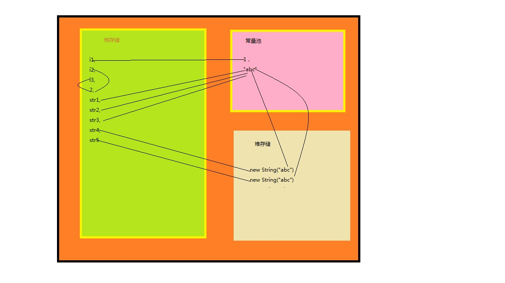

java 数据存储方式
=============

java 数据存储主要有五种方式：寄存器，栈存储，堆存储，常量池，非RAM存储区

1.寄存器
java数据存储中最快的区域，位于处理器中，但是空间是最少的。该区域由根据需求自动分配，由系统管理。

2.栈存储
该存储区域位于RAM中，存取速度仅次于寄存器。数据结构是栈，具有先进先出的特点。该区域主要存放8中基本类型(byte,short,int,boolean,long,double,char,long)和对象引用。
如 int a=1;String str="Hello World"; C c =new C(); 存放在栈存储中的有a,1,str,c。该存储区域特点还有编译器在编译时就要确认其大小和生命周期。

3.堆存储
该存储区域也位于RAM中，编译时不需要指定其大小，代码运行时自动分配大小。该区域主要存放new 出来的对象。如C c=new C(),如上文所述c存放在栈存储中，new C()存放在堆存储中。堆存储空间分配和回收，由JVM自动执行。

4.常量池
该存储区域也位于RAM中，主要存储在程序整个生命周期的值，如String,static final 关键字修饰的变量值。需要说明一下String变量，String不是基本数据类型，在程序中使用率很高。为了提供重用性、节约内存空间，JVM会将所有的字符串存放在常量池中，如果使用字符在常量池已存在直接返回这个应用自动，不需要重复创建。

如：
String s1="abc";String s2 ="bcd";String s3="abc"; 常量池中只有两个内容"abc","bcd".

引申：
如下下述代码，我们知道输出值为false.
```java
        String a=new String("Hello World");
        String b=new String("Hello World");
        System.out.println(a==b);
```
如果代码如下呢？输出值为true.
```java
        String a="Hello World";
        String b="Hello World";
        System.out.println(a==b);
```
5.非RAM存储区域
该区域不在RAM中，如File文件等。

案例分析：
----------

1.如下代码，画出数据存储结构
```java
    public class number {
        final static int i1 =1;
        int i2=2;
        int i3=2;
        String str1= "abc";
        String str2= "abc";
        String str3= "abc";
        String str4= new String("abc");
        String str5= new String("abc");
    }
`````
存储结构图如下：


2.如下代码，String共申请几份空间
```java
    public class number {
        String str1= "Hello";
        String str2=" World";
        String str3=" !";
        String str4=str1 + str2 +str3; 
    }
```
共申请了5份空间，分别是"Hello","World","!","Hello World","Hello World !"

引申：该问题也解释了字符串拼接推荐使用StringBuffer或者StringBuilder

参考资料
---------
[1]http://www.cnblogs.com/hzdtf/articles/5419782.html

